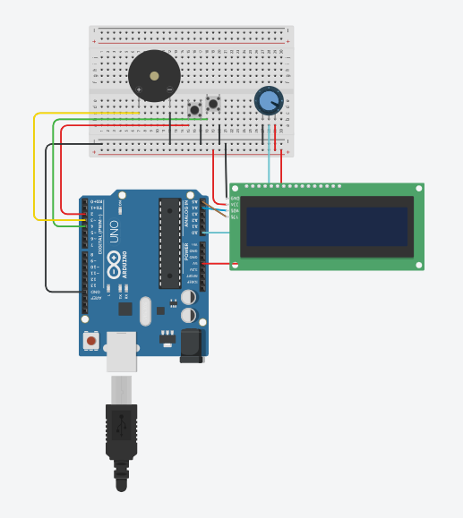
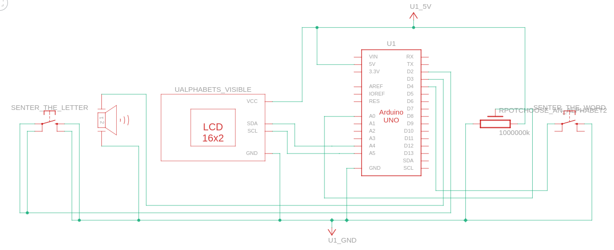

# Morse-Code-Transmitter

## About :
This is a device that allows users to convert text messages into Morse code and transmit them using both visual and audible signals.

## Requirements :
The device is built using an Arduino microcontroller board, an LCD screen, a potentiometer, a buzzer, and an LED light.The potentiometer allows users to input alphabets and the LCD screen displays the text. The buzzer and LED light are used to transmit the Morse code in both visual and audible forms.

## Applications :
The device is useful for a variety of applications, such as emergency signaling or for use in areas where speech communication is difficult.

## Diagram :
</img>

## Circuit Diagram :
</img>

